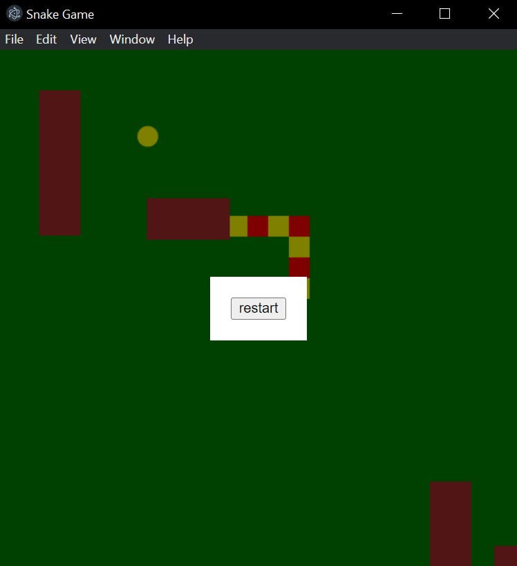
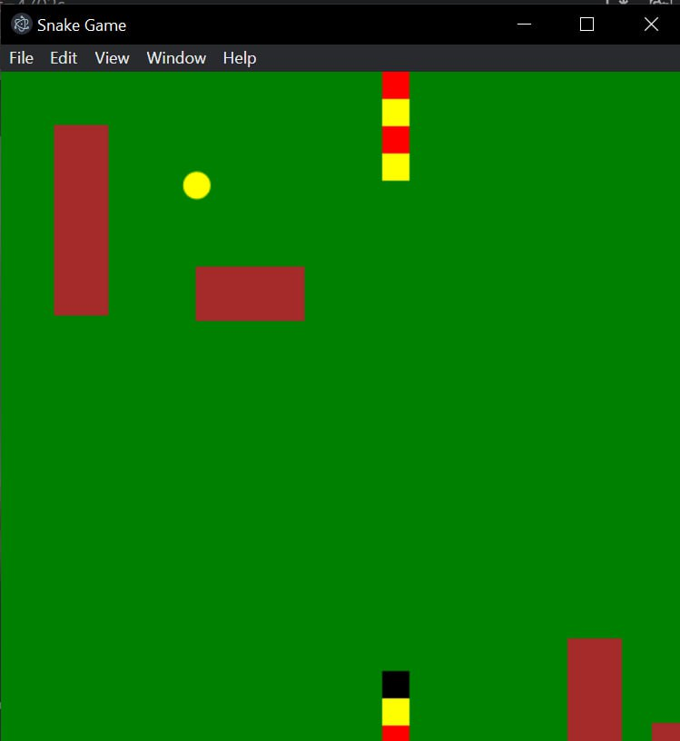
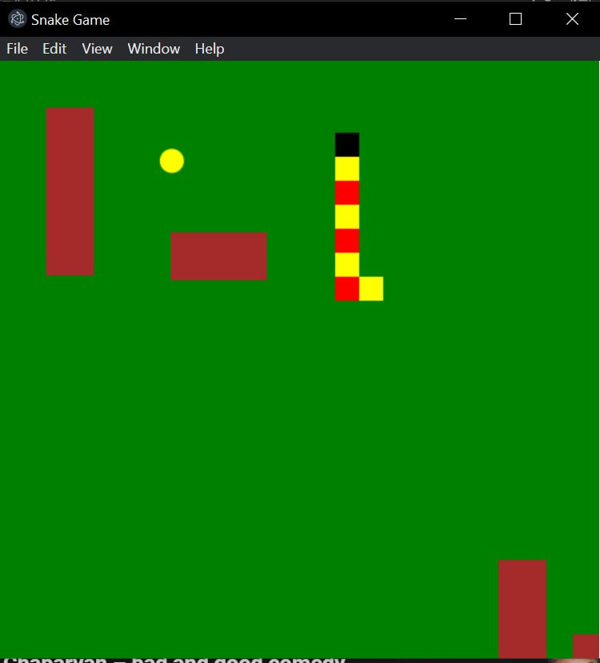
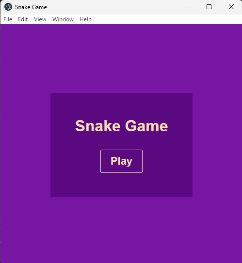

<h1 align="center">🎮Snake 🐍</h1>

<h3 align="center">Snake Game wtitten in TypeScript and ElectronJS</h3>

       

<h2 align="center">Patterns</h2>
<ul>
  <li>MVC</li>
  <li>Factory</li>
  <li>Singleton</li>
</ul>

  
  
  
  

<h1 align="center">Setup and Get Started</h1>

## Setup

- Clone the repository
  `git clone https://github.com/razachikyan/snake-electron.git`

- Open the project folder
  `cd snake-electron`

- Install the dependencies
  `npm install`

- Build the project
  `npm run build`

## Get Started

- Run the Game
  `npm start`

## How to play

### Move the Snake to each as much apples as possible 🍎
  &#8593;
&#8592;  &#8594;
  &#8595;